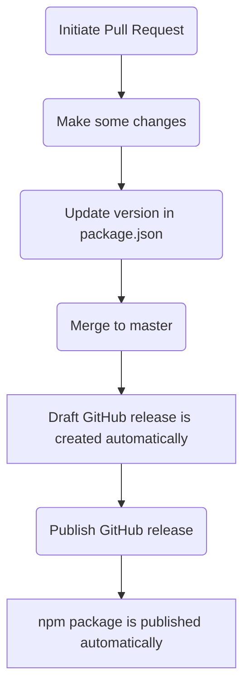

# Contribution

## Release lifecycle

```mermaid
flowchart TD
  A(Initiate Pull Request) --> B(Make some changes)
  B --> C(Update version in package.json)
  C --> D(Merge to master)
  D --> E[Draft GitHub release is created automatically]
  E --> F(Publish GitHub release)
  F --> G[npm package is published automatically]
```