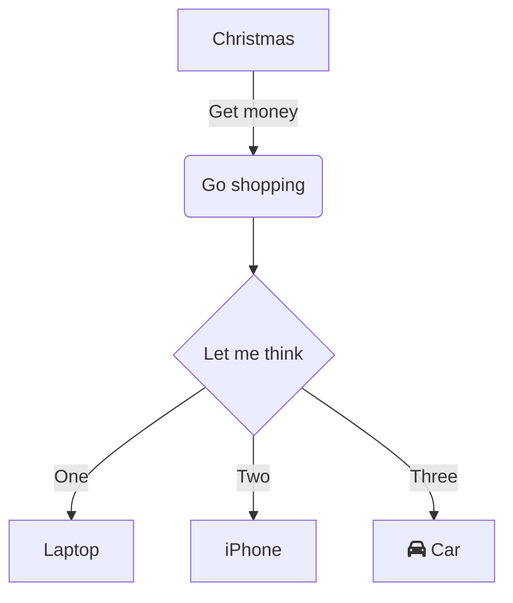

# 3. Mermaid.js

Mermaid.js is a javascript library that allows you to generate diagrams using a simple markdown-like syntax. It is used to generate the diagrams in this documentation. 

Mermaid diagrams are supported in GitHub and GitLab file explorers. And it also is redered in this template.

## Usage

In order to define diagram in markdown, you need to create a code block with the language set to `mermaid`.

